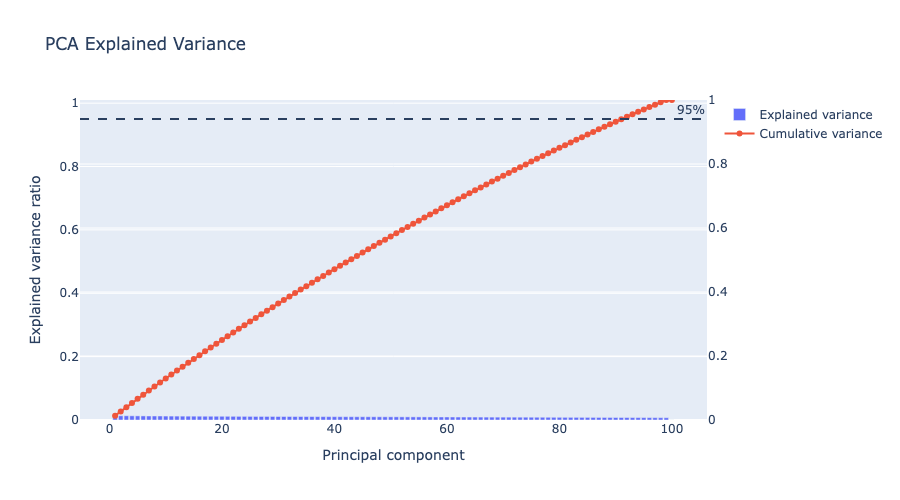
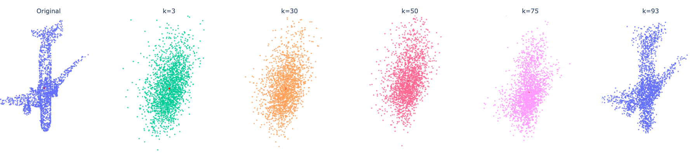

# Statistical Shape Modeling of 3D Objects

This project builds a statistical shape model for 3D object point clouds using **Principal Component Analysis (PCA)**.

The dataset contains point clouds with **dense correspondence**, meaning that the same point index represents the same semantic/geometric region across all shapes. This makes it possible to apply PCA directly to the 3D coordinates and study the main modes of shape variation.

## Overview

The goal of the project is to analyze 3D object shape variability and reconstruct shapes using a reduced number of principal components.

The pipeline includes:

- loading dense-correspondence point clouds and normalize each shape;
- applying PCA;
- analyzing eigenvalues and explained variance;
- reconstructing shapes with different numbers of components;
- visualizing the mean shape and the main PCA deformation modes.

## Data Representation

Each object is represented as a point cloud with `P` points:

```text
[(x1, y1, z1), (x2, y2, z2), ..., (xP, yP, zP)]
```

For PCA, each point cloud is flattened into a vector:

```text
[x1, y1, z1, x2, y2, z2, ..., xP, yP, zP]
```

The resulting data matrix has shape:

```text
N x 3P
```

where `N` is the number of shapes and `3P` is the number of coordinates per shape.

## Method

Instead of explicitly building the full covariance matrix, `scikit-learn` computes PCA using an SVD-based approach, which is more stable for high-dimensional data.

The eigenvalues measure how much variance is explained by each principal component. The cumulative explained variance is used to choose the number of components needed to represent the dataset.

For example in the airplane dataset , **93 principal components** are needed to explain approximately **95% of the total variance**.

## Results

### Explained Variance



### Shape Reconstruction

A shape is reconstructed using the first `K` principal components:

```text
x_hat = mean_shape + PCA_scores_K @ PCA_components_K
```

As `K` increases, the reconstruction becomes closer to the original shape.



## Project Structure

```text
Statistical_Shape_Modeling/
├── data/
│   ├── 02691156.h5
│   └── 02958343.h5
├── notebook/
│   └── pca_analysis.ipynb
├── outputs/
│   ├── airplanes/
│   └── cars/
├── plots/
│   ├── ExplainedVariance.png
│   └── reconstruction2.png
├── scripts/
│   └── pca_point_clouds.py
├── requirements.txt
└── README.md
```

## How to Run

Install the required packages:

```bash
pip install -r requirements.txt
```

Run PCA on the airplane dataset:

```bash
python scripts/pca_point_clouds.py data/02691156.h5 --output-dir outputs/airplanes/pca_point_clouds
```

Run PCA on the car dataset:

```bash
python scripts/pca_point_clouds.py data/02958343.h5 --output-dir outputs/cars/pca_point_clouds
```

The analysis and visualizations are available in:

```text
notebook/pca_analysis.ipynb
```

## Main Takeaway

The project shows how PCA can be used to build a compact statistical representation of 3D object shapes when dense point correspondence is available. The model can analyze geometric variation, reconstruct shapes with a reduced number of components, and visualize the main modes of deformation.

 